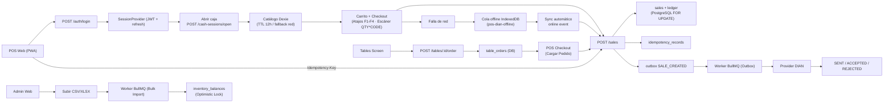

# ARCHITECTURE

> Última actualización: Junio 2026

## Objetivo

`pos-dian` es un POS multi-tenant para Colombia, orientado a operación real de caja y cumplimiento DIAN sin meter la emisión fiscal dentro del request de venta. Diseñado bajo los principios de **desacoplamiento asíncrono**, **offline-first** y **observabilidad distribuida** desde el primer día.

---

## Componentes del Sistema

| Componente | Stack | Rol |
|---|---|---|
| `apps/api` | Fastify · TypeScript · Kysely · Zod · OpenTelemetry | Auth, sucursales, caja, catálogo, ventas, configuración fiscal, billing, importaciones masivas, trazas OTLP y backoffice global SaaS |
| `apps/worker` | BullMQ · TypeScript · PostgreSQL | Consumo del outbox, DIAN, importaciones masivas (Enterprise), Schedulers (Limpieza, Alertas, Rollups) |
| `apps/pos-web` | React · Vite · Dexie.js · PWA (Workbox) | Shell POS offline-first, backoffice (Identity, Tenants), Control Center SuperAdmin, historial y configuración |
| `packages/shared` | TypeScript · Zod | Contratos, tipos y esquemas compartidos entre API, worker y web |

---

## Entidades Clave (Modelo de Datos)

- **`tenants` / `tenant_subscriptions` / `billing_plans`**: Gestión multi-tenant y modelo SaaS prepago.
- **`users` / `user_branches`**: RBAC (PlatformOwner, TenantOwner, Admin, Cashier, Manager).
- **`inventory_balances` / `inventory_ledger` / `inventory_adjustments`**: Fuerte consistencia de inventario (Optimistic Locking & Ledger inmutable).
- **`sales` / `sale_items` / `sales_ledger`**: Venta operativa con protección por idempotencia (`client_uuid`).
- **`deliveries` / `delivery_items` / `delivery_persons`**: Módulo de domicilios con seguimiento de estados (Pending, En Camino, etc.) y facturación asíncrona.
- **`rooms` / `tables` / `table_orders` / `table_order_items`**: Módulo de gestión de mesas y pedidos presenciales (sincronizados con backend para control centralizado de cuentas).
- **`payment_transactions`**: Transacciones de pago y webhooks de pasarelas (Wompi, MercadoPago).
- **`bulk_import_jobs`**: Control de cargas masivas de catálogo procesadas en background.
- **`idempotency_records`**: Tracking de peticiones seguras (ej. creación de ventas) con TTL de 24h.
- **`dian_documents` / `outbox_events`**: Orquestación asíncrona de facturación electrónica.

---

## Flujos de Sistema

### 1. Flujo POS Completo

```
pos-web → POST /auth/login
→ SessionProvider persiste token + restaura en recarga + invalida en 401
→ Seleccionar sucursal → POST /cash-sessions/open
→ Cargar catálogo (Dexie TTL 12h → API → Dexie fallback offline)
→ Búsqueda por nombre, código de barras o QTY*BARCODE
→ Checkout: CreateSaleInput { Idempotency-Key header, client_uuid, branch_id, cash_session_id, items, payments }
→ POST /sales → API intercepta Idempotencia, usa Bloqueo Pesimista (FOR UPDATE) en inventario, calcula fiscal, guarda venta + ledger + outbox
→ Si falla por red → IndexedDB offline queue → sincroniza al reconectar
→ Historial → reimpresión → anulación (ADMIN)
```

### 2. Flujo Fiscal Colombia

- Todos los montos en `*_cents` (centavos de COP).
- El POS trabaja con **precio final al consumidor**; los impuestos nunca se calculan en el frontend.
- `tenants.tax_mode` define el modo fiscal del negocio: `IVA` o `INC_RESTAURANT`.
- `products.tax_category` por producto: `IVA_19`, `IVA_5`, `IVA_0`, `EXEMPT`, `EXCLUDED`, `INC_8`.
- La API resuelve y persiste: `subtotal_cents`, `discount_cents`, `tax_total_cents`, `tax_lines_json`, `total_cents`.
- El ticket muestra texto contextual: `Incluye IVA` o `Incluye INC`.

### 3. Flujo DIAN con Worker (Transactional Outbox)

```
1. API inserta venta + dian_documents (INVOICE, PENDING) + outbox SALE_CREATED (transacción atómica)
2. Scheduler del worker → jobs BullMQ por outbox pendiente
3. outbox-sale-created.processor: carga venta, items, tenant, sucursal
4. Construye payload fiscal: taxMode, taxTotalCents, taxLines, items, pagos, datos negocio
5. Provider DIAN devuelve resultado
6. Worker aplica transiciones centralizadas:
   PENDING → SENT | SENT → ACCEPTED | SENT → REJECTED | PENDING → REJECTED
7. Transiciones inválidas se rechazan. Documentos ACCEPTED + CUDE no se reemiten.
8. Si el provider falla → outbox pasa a retry con backoff exponencial
```

### 4. Anulación Fiscal y Nota Crédito

```
POST /sales/:id/void (solo ADMIN, requiere motivo)
→ Venta → VOID, persiste void_reason, voided_by_user_id, voided_at
→ Repone inventario atómicamente
→ Audita SALE_VOIDED
→ Si existe factura INVOICE → crea outbox SALE_VOIDED
→ Worker espera hasta que INVOICE esté ACCEPTED
→ Crea o reutiliza dian_documents CREDIT_NOTE con parent_document_id
→ CREDIT_NOTE inicia su propia máquina de estados desde PENDING
→ GET /sales/:id mantiene compatibilidad exponiendo dian_document como la factura principal
```

### 5. Flujo Offline y Sincronización

```
1. Cada venta crea client_uuid = crypto.randomUUID() en el frontend
2. POST /sales falla por red → addPendingSale(payload) → IndexedDB (pos-dian-offline)
3. POS muestra contador de ventas pendientes
4. window 'online' event → syncPendingSales() automático
5. flushPendingSales: lotes de 5, MAX_SYNC_ATTEMPTS = 5
6. Si backend responde 409 (client_uuid ya existe) → venta se da por sincronizada (idempotencia)
7. Si backend responde 401 → sincronización se detiene; espera re-login
8. Si sync_attempts >= 5 → estado ABORTED, visible para el cajero con opción de reintentar

### 6. Carga Masiva (Enterprise Bulk Import)

```
1. Usuario sube CSV/Excel (hasta 50,000 productos)
2. API (multipart) procesa en chunks stream-based y encola job en BullMQ (`bulk-import-queue`)
3. Worker procesa por chunks (batching), validando SKUs, tipos, y previniendo duplicados
4. Se maneja `processed_rows`, `valid_rows` y estado completado
5. Interfaz actualiza barra de progreso sin bloquear uso del POS
```

### 7. SaaS Billing & Subscriptions

```
1. API expone `/api/v1/billing/checkout` → redirección a Pasarela (Wompi/MercadoPago)
2. Usuario completa pago → Redirección a la App
3. Webhook asíncrono `/api/v1/webhooks/:gateway`
4. Validación de firma criptográfica
5. Actualización atómica de `payment_transactions` y `tenants.plan`
```

### 8. Flujo de Domicilios (Delivery Module)

```
1. Cajero o Toma-pedidos crea un domicilio con datos del cliente y productos.
2. Estado inicial: PENDING.
3. Cocina toma el pedido → PREPARATION.
4. Se asigna repartidor (DeliveryPerson) → ON_WAY.
5. Repartidor entrega → DELIVERED → Se dispara la facturación electrónica/creación de Sale.
6. Si el cliente paga por adelantado, la facturación se asocia de inmediato y el cobro se asegura antes del envío.
```

---

## Arquitectura Offline-First (PWA)

### Capas de Persistencia

| Capa | Tecnología | Base de Datos | Propósito |
|---|---|---|---|
| Catálogo (lectura) | Dexie.js | `pos-dexie-db` | Productos y clientes con TTL de 12h por `branch_id` |
| Cola de mutaciones (escritura) | IndexedDB nativo | `pos-dian-offline` | Ventas pendientes offline |
| Journal de operaciones | Dexie.js | `pos-journal-db` | Log de operaciones genéricas para sync |
| Fallback en memoria | `Map<string, ...>` | RAM | Si IndexedDB no está disponible (navegación privada, disco lleno) |
| Assets | Service Worker (Workbox) | Cache API | HTML, CSS, JS — acceso sin red |

### Estrategia de Resiliencia

- `useProductCatalog`: Intenta red → si falla, carga Dexie → si no hay caché, lanza error
- `navigator.storage.persist()` llamado en `main.tsx` para prevenir evicción por el SO (crítico en tablets iOS con poco espacio)
- `isClientUuidAlreadyRegistered` detecta HTTP 409 durante sync y lo trata como éxito (evita doble cobro)

---

## UX de Alta Velocidad (Cajero)

### Atajos de Teclado Globales

| Contexto | Tecla | Acción |
|---|---|---|
| Pantalla POS | `Ctrl+K` | Foco en buscador de productos |
| Buscador | `↑ / ↓` | Navegar lista de productos |
| Buscador | `Enter` | Agregar producto destacado al carrito |
| Buscador | `F4` | Abrir modal de cobro |
| Buscador | `P` | Aparcar carrito activo |
| Modal de cobro | `F1` | Seleccionar Efectivo |
| Modal de cobro | `F2` | Seleccionar Tarjeta |
| Modal de cobro | `F3` | Seleccionar Transferencia |
| Modal de cobro | `F4` | Seleccionar Pago Mixto |
| Modal de cobro | `Enter` | Confirmar venta (si formulario válido) |

### Multiplicador de Escáner

Sintaxis: `CANTIDAD*CÓDIGO_DE_BARRAS`  
Ejemplo: teclear o escanear `5*7701234567890` → agrega 5 unidades directamente.  
Funciona tanto desde teclado (campo de búsqueda) como desde escáner físico de hardware.

### Flujo Táctil Inteligente

- **Mesas Primero**: Si el módulo de mesas está activo, el cajero es recibido por la pantalla de Salones, desde donde con 1 tap ingresa al carrito de esa mesa en el POS.
- **Categorías Táctiles**: Sin texto en la barra de búsqueda, el POS muestra un `CategoryGrid` de botones grandes (optimizado para tablets) priorizando *Bebidas, Entradas, Platos Fuertes*, etc. Al seleccionar una, el grid de productos se filtra al instante.
- Al escribir en el buscador, el filtro táctil se interrumpe para priorizar la búsqueda global y de código de barras sin romper la agilidad.

### Responsive Táctil

Breakpoints CSS en `global.css`:
- `1280px`: sidebar del carrito → 340px
- `1024px`: sidebar → 300px, checkout 2 columnas
- `768px`: layout columna única con `grid-template-rows: 1fr auto`, scroll interno, sin scroll de página
- `640px / 480px / 380px`: ajustes tipografía, grillas y espaciados

---

## Integraciones de Hardware

### Impresión de Tickets
- **HTML dinámico:** Generación de ticket 58mm u 80mm en una ventana nueva. Selección guardada en configuración del tenant.
- **ESC/POS directo:** Conexión por Web Serial API (`navigator.serial`) a impresoras térmicas sin diálogos del sistema. Ver `ticket-printer.ts`.

### Báscula Digital (Web Serial API)
- Archivo: `apps/pos-web/src/lib/hardware.ts` → `readScaleWeight()`
- Abre el puerto serial en baudRate 9600 (compatible Mettler, CAS y similares)
- Lee el peso, limpia el string (`"  0.450 kg\r\n"` → `0.450`) y lo aplica como cantidad del ítem del carrito
- Timeout de 2 segundos; errores presentados en un `alert` contextual

---

## Observabilidad Distribuida

### Stack (Infraestructura Local)

```
apps/api ──OTLP HTTP──► otel-collector ──► Prometheus (métricas)
                                       ──► Tempo (trazas)
                                       ──► Loki (logs)
                                             ↑
                                          Grafana
```

Configurado en `infra/docker-compose.obs.yml`. Levantar con:
```bash
cd infra && docker compose -f docker-compose.obs.yml up -d
```

### Instrumentación en API (`apps/api/src/tracing.ts`)

- OpenTelemetry Node SDK con auto-instrumentaciones (HTTP, PostgreSQL)
- Exporter OTLP HTTP: `OTLP_TRACE_ENDPOINT` (default `http://localhost:4318/v1/traces`)
- W3C Trace Context Propagator para trazas distribuidas entre servicios
- **Métricas de negocio custom** vía `posMeter`:
  - `pos.sales.count` — contador de ventas por tenant

### Worker

El worker loguea por job: `outbox_event_id`, `sale_id`, `tenant_id`, `attempt`, transición DIAN y resultado del provider.

---

## Roles y Permisos

| Rol | Permisos clave |
|---|---|
| `PLATFORM_OWNER` / `PLATFORM_ADMIN` | Control total del SaaS: Gestión de Tenants (crear, suspender, reactivar), cambio de planes de facturación, y CRUD transversal sobre los usuarios de cualquier Tenant. |
| `ADMIN` | Todo en su Tenant: configurar negocio, sucursales, usuarios, productos, anular ventas, dashboard global, auto-gestión de suscripción, control total de caja |
| `MANAGER` | Sus sucursales: administrar el personal de piso (cajeros y meseros), reportes, movimientos de inventario. **Sin** dashboard global, anulaciones ni facturación |
| `CASHIER` | Abrir/cerrar su caja, vender, ver historial de ventas, ver saldos de inventario |
| `WAITER` | Tomar pedidos en mesa y enviarlos a cocina. **Sin** caja, catálogo, usuarios ni anulaciones. Incluye `sales:create` porque las pantallas de Mesas y POS se habilitan con ese permiso (D-047) |
| `AUDITOR` | Solo lectura global: trazabilidad, alertas, audit logs |

Los roles se derivan de una sola lista (`USER_ROLES` en `packages/shared`); estuvieron escritos a mano en cinco sitios y desincronizados, con la consecuencia de que `WAITER` fue inalcanzable durante meses pese a existir en el enum de Postgres (D-045).

### Mesero ≠ usuario con rol `WAITER`

Son dos cosas distintas y conviene no confundirlas:

- La **plantilla de meseros** vive en la tabla `waiters` (nombre, PIN opcional, sucursal). Es lo que se asigna a una mesa: `tables.waiter_id`, `table_orders.waiter_id` y `sales.waiter_id` referencian `waiters.id` desde la migración 074.
- El **rol `WAITER`** es una cuenta de acceso a la aplicación, para el mesero que además usa una tablet. `waiters.user_id` los vincula cuando ambos existen, y es opcional.

La mayoría de los meseros de un restaurante no necesita cuenta. Ver D-046.

---

## Seguridad

### Aislamiento por tenant (RLS)

Es la única barrera que separa a un comercio de otro, así que conviene entender exactamente dónde vive.

**El mecanismo.** Cada petición que toca datos de negocio pasa por `executeAsTenant(db, tenantId, fn)`, que abre una transacción y ejecuta `set_config('app.current_tenant', <id>, true)` — el `true` es local a la transacción, de modo que el valor no se filtra a la siguiente petición que reutilice esa conexión del pool. Las políticas comparan:

```sql
tenant_id::text = current_setting('app.current_tenant', true)
```

Si nadie fijó la variable, `current_setting(..., true)` devuelve `NULL`, la comparación es `NULL` (no verdadera) y la consulta devuelve **cero filas**. Olvidar el contexto es un bug visible —una pantalla vacía—, no una fuga silenciosa.

**Quién se conecta.** El mecanismo anterior no sirve de nada si el rol de conexión salta las políticas, que es exactamente como estuvo el sistema hasta la fase 2: RLS habilitado, políticas escritas, y la API conectada con el dueño del esquema, que las ignora por definición. Desde entonces:

| Conexión | Rol | Para qué |
|---|---|---|
| `DATABASE_URL` | `pos_api` (miembro de `api_user`) | La API. Sin `BYPASSRLS`, sin `SUPERUSER`, sin DDL. |
| `ADMIN_DATABASE_URL` | dueño del esquema | Migraciones y semillas, nada más. |
| worker | dueño del esquema | Deliberado: bandeja de salida, rollups y renovaciones recorren todos los comercios por diseño. Su superficie de entrada son jobs propios, no peticiones de usuario. |

Todas las tablas de negocio llevan además `FORCE ROW LEVEL SECURITY`, para que ni el dueño se salte las políticas si alguien vuelve a apuntar la API allí por accidente.

**Lo que apareció al mover la conexión.** El cambio de rol destapó tres clases de defecto que llevaban meses ocultos, corregidos en la migración `088_rls_consistency`:

1. **Variable equivocada** (`order_rounds`, `tenant_dian_settings`): las políticas leían `app.current_tenant_id`, que nadie fija. Con RLS real habrían devuelto cero filas — y en el caso de `tenant_dian_settings` eso significa ninguna credencial del PAC, es decir, ninguna factura emitida.
2. **RESTRICTIVE sin permisiva** (6 tablas de restaurante y domicilios): en PostgreSQL una política restrictiva *acota* a las permisivas; sin ninguna permisiva que acotar, niega todo. Domicilios, meseros y cocina se habrían apagado por completo.
3. **Sin RLS** (10 tablas con `tenant_id`, incluida la partición por defecto de `audit_logs`): el aislamiento dependía enteramente de que ninguna consulta olvidara su `WHERE tenant_id`.

**Exclusiones deliberadas.** `refresh_tokens` queda fuera (D-015): el ciclo de autenticación necesita leerla *antes* de saber a qué tenant pertenece la petición. Las tablas de plataforma (`tenants`, `plans`, `subscription_events`) tampoco llevan política de tenant porque su alcance es transversal por naturaleza; su control es de rol, no de fila. La lista completa y su justificación están en D-038.

**Cómo se verifica.** `apps/api/src/shared/infra/db/__tests__/rls.spec.ts` corre contra PostgreSQL real: lectura cruzada por id, `UPDATE`/`DELETE` sobre filas ajenas, `INSERT` a nombre de otro tenant y `COUNT(*)` sin `WHERE`. Un `beforeAll` consulta `pg_roles` y **falla la suite** si el rol de conexión tiene `BYPASSRLS`, porque en ese caso las pruebas pasarían sin comprobar nada — que es precisamente lo que ocurría antes, con tres de ellas marcadas `skip`.

### Resto de controles

- **JWT:** Tokens de corta duración + refresh tokens por tenant. El token de sesión **no** se acepta por la URL salvo en streams SSE (`GET …/stream`), donde `EventSource` no admite cabeceras; ahí se redacta del log (D-049).
- **`JWT_SECRET`:** en producción se valida por variedad, no solo por longitud — se rechazan los marcadores de posición y los secretos de menos de 16 caracteres distintos (D-054).
- **Cabeceras:** `@fastify/helmet` con HSTS en producción y `referrer-policy: no-referrer`. Sin CSP a propósito: la API sirve JSON y Swagger, no el HTML de la aplicación (D-053).
- **`/metrics`:** cerrado en producción tras `METRICS_TOKEN`, con comparación en tiempo constante; sin token configurado responde 404 (D-050).
- **Rate Limiting:** Login con `AUTH_LOGIN_RATE_LIMIT_MAX` / `AUTH_LOGIN_RATE_LIMIT_WINDOW_MS`.
- **CORS:** Configurable por entorno (`CORS_ALLOWED_ORIGINS`).
- **Errores de validación:** 400 con el campo que falla, no 500 (D-048).
- **`request_id`:** Inyectado en todos los logs del API para trazabilidad por request.
- **`audit_logs`:** Apertura/cierre de caja, creación/anulación de venta, cambios fiscales y de catálogo.

---

## Diagrama de Flujo Completo



---

## Pendientes para Producción

Plan completo y razonado en `docs/ROADMAP-PRODUCCION.md`.

| Ítem | Estado |
|---|---|
| Compilación, esquema desde cero y suite verde en CI | ✅ Fase 0 |
| Correcciones de negocio (stock, totales fiscales, caja, anulación, mock DIAN, credenciales cifradas) | ✅ Fase 1 |
| RLS aplicado por el motor con rol sin `BYPASSRLS` | ✅ Fase 2 |
| Apagado ordenado, `helmet`, `/metrics` autenticado, token fuera del query string | ✅ Fase 3 |
| Gestión de secretos en un gestor real y rotación de las credenciales de ejemplo | ⏳ Infraestructura |
| Provider DIAN real (PAC) certificado | ⏳ Fase 4 |
| Cierre de ciclo para documentos en estado `SENT` | ⏳ Fase 4 |
| Control de resolución y prefijo de numeración | ⏳ Fase 4 |
| Escalado horizontal (advisory locks, adaptador Redis de Socket.io, `SKIP LOCKED`) | ⏳ Fase 5 |
| Despliegue HTTPS, multi-instancia | ⏳ Pendiente |
| Políticas operativas: soporte, rotación de usuarios, ensayo real de restauración | ⏳ Pendiente |
| Observabilidad centralizada (stack Grafana) | ✅ Implementado localmente |
| Integración hardware (impresoras, báscula) | ✅ Implementado (Web Serial API) |
| **Backup automático PostgreSQL + GCS** | ✅ Implementado (GitHub Actions) — la *restauración* nunca se ha ensayado de punta a punta |
| **Medición SaaS (billing metrics)** | ✅ Implementado (snapshot scheduler) |
| **Feature Flags Jerárquicos** | ✅ Implementado (macro + micro) |

---

## Sistema de Feature Flags (D-029)

El SaaS gestiona las funcionalidades de cada tenant mediante un sistema jerárquico de dos capas almacenado en `tenants.modules_json`.

### Flags Macro (habilitación de módulo completo)

| Flag | Módulo |
|---|---|
| `enable_restaurant` | Flujo de restaurante (mesas, meseros) |
| `enable_kds` | Kitchen Display System |
| `enable_delivery` | Módulo de domicilios |
| `enable_inventory` | Inventario avanzado |
| `enable_reservations` | Reservas de mesas |
| `enable_fiscal` | Facturación electrónica DIAN |
| `enable_loyalty` | Programa de fidelización |
| `enable_advanced_reports` | Reportes avanzados |

### Flags Micro (granulares por módulo)

Activables solo cuando su Macro padre está activo. Al desactivar el Macro, los Micro se desactivan en cascada preservando su estado para reactivación futura.

```
enable_restaurant
  ├── enable_tables
  ├── enable_split_bill
  ├── enable_guests_count
  ├── enable_tips
  ├── enable_modifiers
  ├── enable_courses
  ├── enable_kds           (también Macro)
  └── enable_kitchen_printing
```

---

## Medición SaaS / Billing Metrics (D-031, D-034)

### Arquitectura de Medición

```
Fastify onResponse hook
  └── billingUsagePlugin
        └── RAM counter (Map<tenant_id, count>)
              └── [cada 50 requests] → INSERT outbox_events (api_metric_tick)

Worker nocturno [rollupBillingUsage]
  ├── COUNT(sales) WHERE status='COMPLETED' AND period
  ├── COUNT(DISTINCT user_id) FROM user_branches
  ├── COUNT(branches) WHERE tenant_id
  ├── SUM(size_bytes) FROM product_images
  ├── COUNT(outbox_events) WHERE type != 'api_metric_tick'
  └── SUM(payload_json->>'count') FROM outbox_events WHERE type='api_metric_tick'
        └── INSERT subscription_events (USAGE_SNAPSHOT, metadata JSON)
```

### Consulta del último snapshot

```sql
SELECT metadata
FROM subscription_events
WHERE subscription_id = $1
  AND type = 'USAGE_SNAPSHOT'
ORDER BY created_at DESC
LIMIT 1;
```

---

## Estrategia de Backup y Recuperación (D-032, D-033)

### PostgreSQL

| Parámetro | Valor |
|---|---|
| Herramienta | `pg_dump` formato custom |
| Frecuencia | Diario a las 02:00 UTC |
| Almacenamiento | Google Cloud Storage |
| Retención | 30 días (purga automática) |
| RPO (pérdida máxima) | ~24 horas |
| RTO (tiempo de recuperación) | ~30–60 minutos |
| Validación | Semanal (domingos, instancia efímera) |
| Costo | ~$0.35 USD/mes |

### Scripts de Operación

```bash
# Backup manual
bash infra/scripts/pg-backup-gcs.sh

# Restore desde GCS
bash infra/scripts/pg-restore.sh gs://pos-dian-backups/postgres/pos_dian_YYYYMMDD.dump

# Validación de integridad
bash infra/scripts/pg-validate-restore.sh
```

### GitHub Actions

- **`backup-database.yml`**: Cron diario (`0 2 * * *`) + validación dominical (`0 3 * * 0`).
- Requiere 3 secrets: `DATABASE_URL_PRODUCTION`, `GCS_BACKUP_BUCKET`, `GCP_SA_KEY`.

### Redis

Configurado con persistencia dual:
- **AOF** (`appendfsync everysec`): máxima pérdida de 1 segundo de datos.
- **RDB** (`save 900 1 / 300 10 / 60 1000`): snapshots automáticos para backup.

