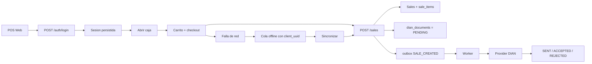

# ARCHITECTURE

## Objetivo
`pos-dian` es un POS multi-tenant para Colombia, orientado a operación real de caja y cumplimiento DIAN sin meter la emisión fiscal dentro del request de venta.

## Componentes
- `apps/api`: Fastify + TypeScript + Kysely. Expone auth, sucursales, caja, productos, ventas, configuración comercial/fiscal y auditoría.
- `apps/worker`: BullMQ + PostgreSQL. Consume outbox, construye payload DIAN, aplica reglas de transición y persiste resultado del provider.
- `apps/pos-web`: React + Vite + PWA. Shell POS con login, apertura de caja, venta, historial, sincronización offline y configuración operativa.
- `packages/shared`: contratos Zod/TypeScript compartidos entre API, worker y web.

## Entidades clave
- `tenants`: tenant comercial. Guarda `tax_mode`, `business_name`, `nit`, `address`, `phone`, `footer_message`.
- `branches`: sucursal operativa. Aporta contexto de caja y datos de ticket por punto de venta.
- `users`: usuarios con rol `ADMIN` o `CASHIER`.
- `cash_sessions`: apertura y cierre de caja por sucursal.
- `products`: catálogo por tenant, con `tax_category` y alcance por sucursal o global.
- `sales` y `sale_items`: venta operativa, totales en `*_cents`, `client_uuid`, metadata de anulación.
- `dian_documents`: documento fiscal por venta, con estado DIAN y CUDE.
- `outbox_events`: eventos de negocio para el worker.
- `audit_logs`: trazabilidad operativa de acciones críticas.

## Flujo POS completo
1. `pos-web` autentica con `POST /auth/login`.
2. `SessionProvider` persiste token y usuario básico, restaura sesión al recargar y la invalida limpiamente en `401`.
3. El usuario selecciona sucursal y abre caja con `POST /cash-sessions/open`.
4. La pantalla POS consume catálogo desde API, busca por nombre o código de barras y arma carrito local.
5. El checkout construye `CreateSaleInput` con `client_uuid`, `branch_id`, `cash_session_id`, `discount_cents`, `items` y `payments`.
6. API valida, calcula impuestos desde DB, asigna consecutivo por sucursal, guarda venta, items, `dian_documents` en `PENDING` y outbox `SALE_CREATED`.
7. POS muestra confirmación e imprime ticket. Si falla por red, la venta queda en cola offline local.
8. Historial lista ventas recientes por sucursal, permite reimpresión y, para `ADMIN`, anulación con motivo.

## Flujo fiscal Colombia
- Todos los montos se manejan en `*_cents`.
- El POS trabaja con precio final al consumidor; no calcula impuestos en frontend.
- `tenants.tax_mode` define el modo fiscal del negocio:
  - `IVA`
  - `INC_RESTAURANT`
- `products.tax_category` define la categoría por producto:
  - `IVA_19`
  - `IVA_5`
  - `IVA_0`
  - `EXEMPT`
  - `EXCLUDED`
  - `INC_8`
- En `POST /sales`, API usa siempre `tax_mode` del tenant y `tax_category` del producto persistido, no lo que llegue del frontend.
- El resultado se persiste en:
  - `subtotal_cents`
  - `discount_cents`
  - `tax_total_cents`
  - `tax_lines_json`
  - `total_cents`
- El ticket muestra texto contextual:
  - `Incluye IVA`
  - `Incluye INC`

## Flujo DIAN con worker
1. API inserta la venta y crea `outbox_events.type = SALE_CREATED`.
2. El scheduler del worker toma eventos pendientes y los convierte en jobs BullMQ.
3. `outbox-sale-created.processor` carga venta, items, tenant y sucursal.
4. El processor construye payload fiscal con:
  - `taxMode`
  - `taxTotalCents`
  - `taxLines`
  - items
  - pagos
  - datos del negocio y sucursal
5. El provider devuelve resultado DIAN.
6. El worker aplica reglas centralizadas de transición:
  - `PENDING -> SENT`
  - `SENT -> ACCEPTED`
  - `SENT -> REJECTED`
  - `PENDING -> REJECTED`
7. Transiciones inválidas se rechazan y documentos `ACCEPTED` no se reemiten.
8. Si el provider falla, el outbox pasa a retry con backoff.

## Flujo offline con `client_uuid`
1. Cada venta se crea en web con `client_uuid`.
2. Si `POST /sales` falla por red, `pos-web` guarda el payload completo en IndexedDB, con estado de sincronización, intentos y último error.
3. El shell muestra contador de ventas pendientes y botón `Sincronizar`.
4. La sincronización puede ser manual o automática al volver la conexión.
5. Se reusa el mismo `client_uuid` en cada reintento.
6. Si backend responde con la venta ya existente para ese `client_uuid`, la web la trata como sincronizada y elimina la pendiente.

## Roles y permisos
- `ADMIN`:
  - configurar negocio
  - cambiar `tax_mode`
  - editar productos y `tax_category`
  - anular ventas
  - abrir/cerrar caja
  - vender y reimprimir
- `CASHIER`:
  - abrir/cerrar caja
  - vender
  - ver historial y reimprimir
  - no ve acciones administrativas ni de anulación

## Observabilidad y seguridad operativa
- API agrega `request_id` y logs estructurados con `tenant_id`, `branch_id`, `user_id` y `sale_id` cuando aplica.
- Worker loguea por job `outbox_event_id`, `sale_id`, `tenant_id`, intento, transición DIAN y resultado del provider.
- `audit_logs` registra apertura/cierre de caja, creación/anulación de venta, cambios fiscales y cambios de productos.
- Login tiene rate limit básico y CORS configurable por entorno.

## Diagrama

## Lo que falta para producción final
- Provider DIAN real end-to-end con gestión de nota de ajuste al anular.
- Observabilidad centralizada fuera de logs locales.
- Despliegue con secretos, HTTPS, backups y operación multi-instancia.
- Integraciones de hardware de impresión y, si aplica, medios de pago físicos.
